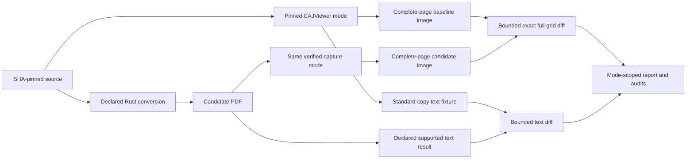

<!-- SPDX-License-Identifier: MIT -->

# CAJViewer vendor fixtures

## Status and scope

**DRAFT — vendor compatibility is `NOT_RUN`, zero passes.** Two original-PDF
startup attempts lost their tmpfs diagnostics. The reviewed transport amendment
collected two loader failures with unavailable `libxslt.so.1`. The measured
provider amendment then collected two file-size-limit failures, exit 153;
the affected file is unknown. The application-limit pair then lost Xvfb to
signal 25 and reported a separate QtWebEngine sandbox error. An original
public shared-memory control confirms the Xvfb file-limit failure and a
bounded 64 MiB allowance without launching the viewer. All eight reported
application attempts/failures from those phases are retained. The fifth pair
kept the launcher/display alive but failed an unverified filename-based window
predicate. Its identical complete viewport payloads show the original
four-page PDF under manual review. Those ten reported startup attempts retain
their FAIL outcomes. The sixth independently frozen pair adds one helper
failure and one owned-window startup observation, keeping document identity
unverified. All twelve attempts are retained; the pair remains FAIL and its
ceiling is exhausted. The failed search's stderr content was not retained.
Original public [terminal-helper diagnostics](cajviewer-linux-startup.md#public-terminal-helper-diagnostics-133)
now retain bounded captured-byte evidence for future failures, preserve the
primary failure without a raster, and enforce the existing receipt limit.
They cannot recover historical stderr or establish a new viewer success;
another application phase needs separately reviewed frozen identities and a
finite cumulative budget.
No private document, complete-page acquisition,
clipboard observation or vendor comparison has been run. The
[startup note](cajviewer-linux-startup.md) preserves the exact phase and failure.
The official Linux documentation confirms reading, text copying, and printing;
it does not establish a supported Linux export CLI or headless API.

This work adds a separate, version-scoped vendor behavior baseline. It does not
replace the pinned Python-converter regression baseline. The completed
[#117 page-composition evidence](hnc8-page-composition-evidence.md) remains a
Python-reference comparison, with the explicit corrected grayscale HN-B basis
and preserved earlier failures. It is not CAJViewer parity.

The initial vendor work covers complete-page image observations and local
standard-copy text observations. It does not add searchable HN output, a new
OCR implementation, or pure-text HN conversion to the v0.1.0 feature contract.
An application observation is evidence about that build and capture mode,
not a universal CAJ format specification.

## What the primary documentation establishes

| Capability | Verified statement | Remaining Linux 9.0 question |
| --- | --- | --- |
| Reading, copying, printing | The [Linux installation guide](https://cajviewer.cnki.net/caj9.0/installGuide.html) lists CAJ, NH, KDH and PDF reading, text copying, and file printing. | The guide includes older package examples; verify behavior in the exact pinned installer. |
| Image conversion and OCR | The [product homepage](https://cajviewer.cnki.net/) advertises CAJ/PDF-to-images and scanned-document OCR. It lists Linux 9.0 alongside newer Windows builds. | Product-family advertising does not prove Linux full-page export, output formats, DPI, offline OCR, or automation. |
| Text selection | The [selection FAQ](https://cajviewer.cnki.net/caj9.0/subAsk/ask_01.html) describes selecting text and whole-page selection. | Selection alone does not prove native Unicode extraction or the absence of OCR. |
| Copy modes | The [copy FAQ](https://cajviewer.cnki.net/caj9.0/subAsk/ask_02.html) distinguishes ordinary line-preserving copy from enhanced paragraph reflow. | Verify which modes Linux exposes and capture each as a different origin. |
| Selected images | The [region-image FAQ](https://cajviewer.cnki.net/caj9.0/subAsk/ask_04.html) describes copying a selected region or pinning it on screen. | A selected region is not proof of a complete-page export. |
| Image panel | The [one-click-image FAQ](https://cajviewer.cnki.net/caj9.0/subAsk/ask_05.html) limits its extraction to non-vector images in electronic documents; scans and vector-only documents are excluded. | This feature cannot serve as the general complete-page oracle. File export and Linux availability remain unverified. |
| Repair and server processing | The [repair FAQ](https://cajviewer.cnki.net/caj9.0/subAsk/ask_09.html) describes changing copied text, including all-page repair. The [privacy policy](https://cajviewer.cnki.net/protocol/privacyAgreement.html) says translation and garbled-text repair upload files for server processing. | Do not use repair or translation in the initial offline fixture path. The policy does not establish that every OCR mode is remote. |

These FAQs describe the general product family. They are not a Linux 9.0
capability guarantee. No supported Linux batch export command, image-export
resolution contract, TXT export contract, native outline export, or public
conversion API has been established by the reviewed primary documentation.
That is an unresolved capability question, not a claim that such features
cannot exist.

The [pinned AUR packaging recipe](https://github.com/archlinux/aur/blob/04001d051c1f8bf7fc82c283b8b9bae4412ea1ed/PKGBUILD)
identifies packaging version `9.0-3`, x86_64, a custom license, and the official
installer URL. Record the installed vendor application build separately;
the packaging version is not an observed application version. The candidate
package pin is
`https://download.cnki.net/cajviewer_9.0_amd64.deb`, SHA-256
`3142c633d74dcf34ebaca9b7653f88ad3619f0b7a6cb689487b6cc583ec926d3`.
The capability task must independently verify its size, identity, applicable
license, and packaging revision before use. The recipe also installs a
documentation directory; bounded review of packaged manuals and license text
is permitted, without inspecting proprietary implementation.

## Issue hierarchy and dependencies

The [vendor-oracle epic #123](https://github.com/rwv/caj2pdf-rust/issues/123)
is a direct child of [#1](https://github.com/rwv/caj2pdf-rust/issues/1). It blocks the
[#14 release gate](https://github.com/rwv/caj2pdf-rust/issues/14). Its six
children follow this graph; issue acceptance criteria remain authoritative:

| Child | Issue | Blocked by |
| --- | --- | --- |
| A | [#124: verify offline CAJViewer Linux container capabilities](https://github.com/rwv/caj2pdf-rust/issues/124) | [#133: terminal-helper diagnostics](https://github.com/rwv/caj2pdf-rust/issues/133), a child of #124 |
| D | [#125: define immutable external fixture manifests and receipts](https://github.com/rwv/caj2pdf-rust/issues/125) | None within this epic |
| B | [#126: acquire reproducible complete-page CAJViewer images](https://github.com/rwv/caj2pdf-rust/issues/126) | A (#124) and D (#125) |
| C | [#127: capture standard-copy text and classify OCR separately](https://github.com/rwv/caj2pdf-rust/issues/127) | A (#124) and D (#125) |
| E | [#128: implement bounded pixel and text diffs with original CI fixtures](https://github.com/rwv/caj2pdf-rust/issues/128) | D (#125), B (#126) and C (#127) |
| F | [#129: validate vendor fixtures and adjudicate conversion differences](https://github.com/rwv/caj2pdf-rust/issues/129) | A–E (#124–#128), [#10](https://github.com/rwv/caj2pdf-rust/issues/10) and [#13](https://github.com/rwv/caj2pdf-rust/issues/13) |

[The immutable manifest reader and regeneration tooling](vendor-fixture-manifest.md)
is complete under [PR #131](https://github.com/rwv/caj2pdf-rust/pull/131);
its original controls report no vendor work. Capability work remains open.
Implement the
comparators after their declared acquisition/manifest blockers are complete. Image and text acquisition are sibling
tasks: success in one channel does not satisfy the other.

The paired observations and their comparison paths remain explicit:

The text comparison path applies only to a declared supported text contract.
Acquiring a reference text fixture does not require searchable HN output or
permit an unsupported candidate result to count as a text pass.

## A: fixed application and public capability canary

Keep the installer, installed application, runtime image, fonts and vendor
assets outside this MIT repository and its release artifacts. Record the
applicable license and distribution rights before publishing any image that
contains them. The [vendor usage agreement](https://cajviewer.cnki.net/protocol/UseAgreement.html)
is a primary reference; it is not a substitute for checking the selected
package's applicable terms. All committed adapters, generators and comparison
code must be independently written and MIT-licensed.

Pin the base-image digest, distribution and architecture; installer and
packaging identities; application build; canonical runtime libraries; fonts;
locale and timezone; graphics/display backend; screen dimensions and density;
Qt scaling; application configuration; and every public automation tool. Do
not infer supported Docker, Xvfb, or offscreen behavior from the use of Qt.
The canary proves the chosen environment before it becomes a private fixture
environment. Do not inspect application code, disassemble it, or call its
private implementation interfaces.

Run as a non-root user with a fresh profile, a private display, read-only
inputs, disabled networking, and no host home or Docker socket mount. Use
documented UI actions or public desktop accessibility, input, and clipboard
interfaces. Record exact launch arguments; a workaround such as disabling a
sandbox must not silently become the default environment.

Generate original small PDFs at runtime, with separately pinned fonts where
needed:

- Asymmetric top/bottom/edge/corner marks, at least two distinct pages, and an
  intentionally all-white page establish orientation and complete-page bounds.
- Born-digital Unicode, punctuation, whitespace and two-column text establish
  selection and order. An image-only version contains no PDF text layer and
  distinguishes copied text from possible OCR.
- Known page sizes and fractional dimensions expose fit-to-paper, scaling,
  clipping, and rounding before any private comparison.

Verify native page-image export, full-page capture, region copy, viewport
capture, print-PDF, ordinary copy, enhanced copy and OCR separately. Record
absent, paid, account-dependent, network-dependent or disabled capabilities
explicitly. Repeat supported observations in two clean sessions. PDF canaries
prove the acquisition workflow; they do not prove CAJ decoding. A small,
separately frozen CAJ pilot is required before broader acquisition.

## D: external manifests and immutable receipts

The application, corpus, derived PDFs, full images, copied private text and
clipboard dumps remain external. Publish only authorized source IDs,
redacted metadata, hashes, protocols and original MIT fixtures. A fixture must
be linked to immutable source bytes and an immutable acquisition receipt;
never overwrite a baseline after a mismatch.

The manifest must distinguish raw exported-file identity from decoded pixel
or decoded-text identity. Require these fields:

- Source ID, exact source SHA-256 and size, source variant, physical page
  index, source page count, and explicit source/output page mapping.
- Application/package/environment identities, capture origin, exact
  commands or ordered UI actions, and enabled/disabled processing modes.
- Image format, channel order, bit depth, alpha/color policy, dimensions,
  physical box where available, DPI/zoom/scale, full-file identity and
  complete decoded-payload identity.
- Text selection coverage, copy mode, clipboard selection and freshness
  evidence, available MIME types, raw encoding/bytes, strict decoding policy,
  Unicode/page boundaries and raw/derived identities.
- Planned and actual work, warnings, attempts, results, unsupported and
  unstarted work, failed calls, elapsed time, measured memory, owned disk,
  command outputs/digests, and before/after audits.

Bound and parse each manifest from the same bytes whose hash was checked.
Validate path confinement, sizes and schema before allocation. A proposed
initial adapter uses at most 64 KiB per file read and a 1 MiB manifest cap;
larger profiles require a reviewed schema/limit amendment. Receipts and result
reports have their own explicit size caps. No mode or missing field receives
an implicit fallback.

Before private-file audits or private-document UI actions, freeze source/fixture and tool pins,
resolved arguments, effective environment, application/runtime identities,
protocol and harness fingerprints. A public preparation stage may determine
installed runtime libraries; bind those identities before private use and
compare them finally. Keep raw environment data external and publish only
appropriate redacted metadata.

## B: complete-page image acquisition

Use the canonical origins `viewer-native-page-image`,
`viewer-complete-page-capture`, and `viewer-exported-pdf-render`. Do not combine them
into one unnamed golden image. Region capture, embedded-image extraction and
a viewport that omits page edges are not complete-page fixtures.

The selected mode must prove all four page edges, orientation, physical box,
scale, background, full grid and page order using the original canary. If a
full-page tiling fallback is needed, freeze exact tile offsets, overlap and
complete coverage and prove reconstruction using original edge markers;
automatic alignment is not permitted. Print-PDF must bind paper, printer and
driver/backend, margins, orientation, source-size/100% scaling and resulting
page boxes. Its label remains print-derived.

Where possible, observe both the source document and the Rust-produced PDF
through the same verified viewer workflow. The receipt must still disclose
their potentially different format/render paths. Exported-PDF-derived images
also bind the external rasterizer and its exact options.

Compare the entire declared candidate grid with its paired baseline: exact
dimensions, every row, every channel and exact complete decoded-payload
length/hash. Record raw exported-file hashes separately; container metadata
nondeterminism must be demonstrated and handled explicitly in the frozen
profile, not silently ignored. A channel-order conversion must be declared
and lossless. No crop, rescale, interpolation, flip, automatic alignment or
undeclared color conversion can make a mismatch pass. Similarity scores may
help diagnose a failure; they are not exact-parity acceptance.

Repeated clean captures establish stability before private golden data is
accepted. Include white pages and nonwhite edge/corner sentinels: an all-white
page may be legitimate, but two blank captures do not prove output exists.
Source/page identity, expected content controls and complete coverage are
required. Keep missing, extra and reordered pages visible.

## C: local standard-copy text acquisition

Initially label the origin **standard-copy text**, not native Unicode.
The born-digital positive and image-only negative canaries must establish the
behavior of the chosen Linux action. Ambiguous mechanism stays explicitly
unverified. Enhanced copy reflows paragraphs; OCR and repair can produce
different content. They must have separate origins and cannot substitute for
ordinary copy. The initial offline fixture path excludes repair, translation
and cloud synchronization. No new OCR engine or searchable-HN implementation
is required by this work.

Before each page or region attempt, install a fresh unique clipboard sentinel
in the declared selection and record its identity. Perform the viewer's copy
action and verify a fresh clipboard transaction with a complete, bounded
content observation before accepting captured data. The adapter must prove
freshness under the selected display and clipboard manager; it may use
ownership/revision events or another demonstrated completion mechanism, but
elapsed time alone is not evidence. A still-present sentinel or timeout is a
failure or unavailable result, not an empty-page result. An explicitly
observed empty copy is classified separately. Stale clipboard content and two
empty captures cannot satisfy a positive text comparison.

Capture all relevant MIME targets and the bounded raw payload. Decode using a
declared strict encoding without injecting replacement characters; a literal
expected U+FFFD is valid data. Preserve Unicode,
spaces, punctuation, line/column order, page separators and selection
coverage. Raw bytes/code points are the primary result. Any newline-only or
NFC comparison is a separately named view with its own identities and counts;
NFKC, whitespace collapse, paragraph reflow and repairs cannot hide primary
mismatches. Record missing selection coverage and unreadable/oversized
clipboard payloads as failures or located unsupported results.

Native/embedded outline export is not documented by the reviewed Linux
sources. Existing Python outline regressions remain in place. Vendor outline
acquisition, smart directories and user bookmarks need a separately declared
capability/manifest extension; they are not inferred from text copying.

## E: bounded comparators and mandatory original tests

Process one page, stripe, text record or manifest at a time with bounded
reads and temporary spooling when required. Do not introduce a whole-file or
whole-corpus buffer API. Check dimensions, products, offsets, encodings and
declared size limits before allocation. Hash every compared pixel/text byte;
retain a bounded located first mismatch and diagnostic counts.

Mandatory original tests must reject changed pixels, a changed row/grid,
vertical flip, missing/duplicate/reordered pages, wrong scale/color origin,
one changed/deleted Unicode character, unexpected/injected replacement characters, reordered
lines/columns, lost page boundaries and stale clipboard data. Exercise
actual public capture/inspection tools where they form the contract, plus
raised/short I/O, malformed manifests, audit mutations, timeout, memory/disk
refusal and cleanup. Separate actual public tool launches from mocked logical
events and from private compatibility attempts.

A clean no-input command reports `NOT_RUN` with zero vendor launches and zero
compatibility passes. An explicit request with missing fixtures, tools or
required capabilities fails. Similarity or OCR diagnostics never count as
exact pixel or standard-copy matches.

## F: bounded rollout and adjudication

Freeze a finite representative matrix before private execution, including
CAJ, HN-A, C8 and HN-B conversion profiles, KDH/PDF preservation profiles, and
named unsupported cases. State
which image and text channels are required for each case. HN-B's six source
rows, two image-bearing output pages and no-image rows must be adjudicated
explicitly; do not drop or shift pages to force agreement.

Apply resource ceilings to the **entire lifetime of every stage**: package
preparation, GUI startup, selection/copy, export/printing, clipboard transfer,
pixel/text decoding and comparison, provenance hashing, final audits and
report persistence. Freeze numeric wall-time, complete process-tree/container
memory, PID, per-file/session disk and output caps; bound X11/clipboard and
report payloads as well as subprocess stdout/stderr. Measure viewer/runtime
memory separately from the converter and harness. A child that closes its
pipes or leaves descendants cannot escape the limits. Preserve cleanup and
audits on failure; a timeout or failed finalization is not `PASS`.

Choose numeric private-run ceilings from the public canary and record them
before execution; no stage may remain unlimited or raise its bound silently.
Count actual attempts, completions, passing/failing/skipped/unsupported work
and unstarted required work. Record warnings and failed launches. Retain the
first failure outside Git and use a reviewed plan amendment for changed
behavior or another attempt.

Publish version/mode-scoped adjudication with exact coverage, tool/options,
resource results and immutable receipt/report identities. Unavailable or
unknown capabilities do not count as exact matches. Passing images do not
pass text; text copying does not pass OCR or outlines. Vendor/Python/native
disagreements become explicit blockers or documented scope limitations, with
their original reports preserved. Do not change native output from private
oracle coordinates or transfer proprietary implementation into the project.

The epic completes only when each child's acceptance criteria are satisfied
and the declared representative vendor matrix has a reviewed outcome. Merely
installing CAJViewer, publishing a container recipe, or skipping optional
fixtures does not satisfy the release-blocking vendor validation work.
